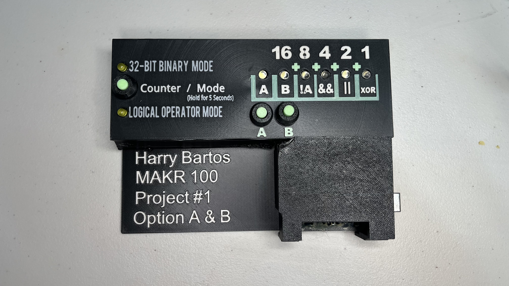
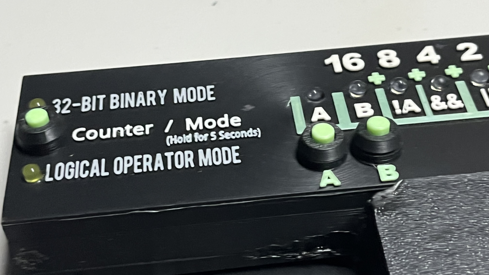

# MAKR 100 — Project 1

## Binary Counter and Logical Operators

**Harry Bartos · MAKR 100 · Fall 2026**

I combined Option A and Option B into one Arduino Uno project. The same set of LEDs displays a binary count in one mode and logical operators in the other. A short press counts; a five-second hold switches modes. The circuit is housed in a custom 3D-printed enclosure.



## What it does

- **Project A — Binary counter:** counts from **0 to 31** using five LEDs with weights **16, 8, 4, 2, 1**. The next count after 31 returns to 0. Five bits give 32 possible values.
- **Project B — Logical operators:** buttons A and B control six outputs: **A**, **B**, **NOT A**, **AND**, **OR**, and **XOR**.
- **Shared controls:** hold Counter/Mode for five seconds to switch projects. Two indicator LEDs show the active mode. The count is preserved when switching modes and resets to zero when the Arduino restarts.
- **Serial output:** displays the decimal count or logic results at **9600 baud**.

### Controls

| Control | Action |
| --- | --- |
| Counter/Mode: short press and release | Add one in Project A; the increment happens on release |
| Counter/Mode: hold for five seconds | Switch between Projects A and B |
| Button A / Button B | Set the two inputs in Project B |

The buttons connect to ground and use `INPUT_PULLUP`: pressed reads `LOW`, released reads `HIGH`. The Mode button has a 50 ms debounce interval, and one long hold changes modes only once.



## Demo video

**Coming soon — the finished demonstration video has not been recorded yet.**

The files in [Pictures](Pictures/) and [Video](Video/) include photos, saved camera clips, animation drafts, and narration material. They are working materials for the project, not a finished demonstration video.

## Hardware and wiring

- Arduino Uno R3 and a USB cable
- Three push buttons
- Six shared data LEDs and two mode indicator LEDs
- Eight 220 Ω resistors, one for each LED
- Prototyping board, wire, and the printed enclosure

The full quantities are in [List Of Materials.xlsx](List%20Of%20Materials.xlsx).

| Uno pin | Project A: binary counter | Project B: logical operators |
| --- | --- | --- |
| D2 | Counter/Mode button | Mode button |
| D3 | Button A, unused in this mode | Button A input |
| D4 | Button B, unused in this mode | Button B input |
| D5 | Project A indicator on | Project A indicator off |
| D6 | Project B indicator off | Project B indicator on |
| D7 | Off | A |
| D8 | 16s bit | B |
| D9 | 8s bit | NOT A |
| D10 | 4s bit | A AND B |
| D11 | 2s bit | A OR B |
| D12 | 1s bit | XOR: exactly one input pressed |

### Circuit layout


See the [wiring diagram PDF](Images/Wire%20Diagram.pdf) for another view. The current pin assignments and behavior are defined in [Program.cpp](Program/Program.cpp).

### Logic results

Here, **1 means pressed/on** and **0 means released/off**.

| A | B | NOT A | AND | OR | XOR |
| --- | --- | --- | --- | --- | --- |
| 0 | 0 | 1 | 0 | 0 | 0 |
| 1 | 0 | 0 | 0 | 1 | 1 |
| 0 | 1 | 1 | 0 | 1 | 1 |
| 1 | 1 | 0 | 1 | 1 | 0 |

The program uses the full XOR expression: `(A && !B) || (!A && B)`.

## Build and upload

The active source is **[Program/Program.cpp](Program/Program.cpp)**. [platformio.ini](platformio.ini) selects the Arduino Uno, the Arduino framework, and the `Program` source folder.

1. Open this repository folder in **VS Code with PlatformIO**.
2. Connect the Uno by USB.
3. Select **PlatformIO → Project Tasks → uno → General → Build**.
4. Select **Upload** to compile and write the firmware to the board.
5. Open **Monitor** at **9600 baud**.

With PlatformIO Core available in your terminal, run these commands from the repository root:

```sh
pio run -e uno
pio run -e uno --target upload
pio device monitor --baud 9600
```

The `.cpp` conversion added function declarations without changing program logic. Both versions built successfully, and the resulting firmware files were byte-for-byte identical: **3,422 bytes of flash and 409 bytes of RAM**. The original `.ino` and comparison record are preserved in [Backups](Backups/).

Keep the backup sketch outside `Program/` so PlatformIO compiles only the active source.

## Project files

| Location | Contents |
| --- | --- |
| [Program](Program/) | Main combined counter/logic program |
| [Binary_Counter_Only](Binary_Counter_Only/) | Standalone counter sketch and its flowcharts |
| [Flowcharts](Flowcharts/) | Main program, button, counter, and logic flowcharts |
| [Images](Images/) | Circuit diagram and additional flowchart images |
| [Pictures](Pictures/) | Build photos and saved camera clips |
| [print files](print%20files/) | Bambu Studio 3MF project and enclosure/button STL files |
| [Report](Report/) | Word and Markdown project report, plus inventory notes |
| [Video](Video/) | Animation sources, draft exports, scripts, and archived revisions |
| [Diagnostics](Diagnostics/) | Mode-button troubleshooting notes and diagnostic sketch |
| [Backups](Backups/) | Original sketch and conversion records |
| [Instructions.pdf](Instructions.pdf) | Assignment instructions |

The report and older diagrams may refer to `Program.ino`; the active PlatformIO source is now `Program.cpp`.

### Downloading the media

Video files are stored with **Git LFS**. To get the full media files when cloning:

```sh
git lfs install
git clone https://github.com/globel420/Project-1.git
cd Project-1
git lfs pull
```

Build output, macOS metadata, and local automation caches are excluded from Git.
